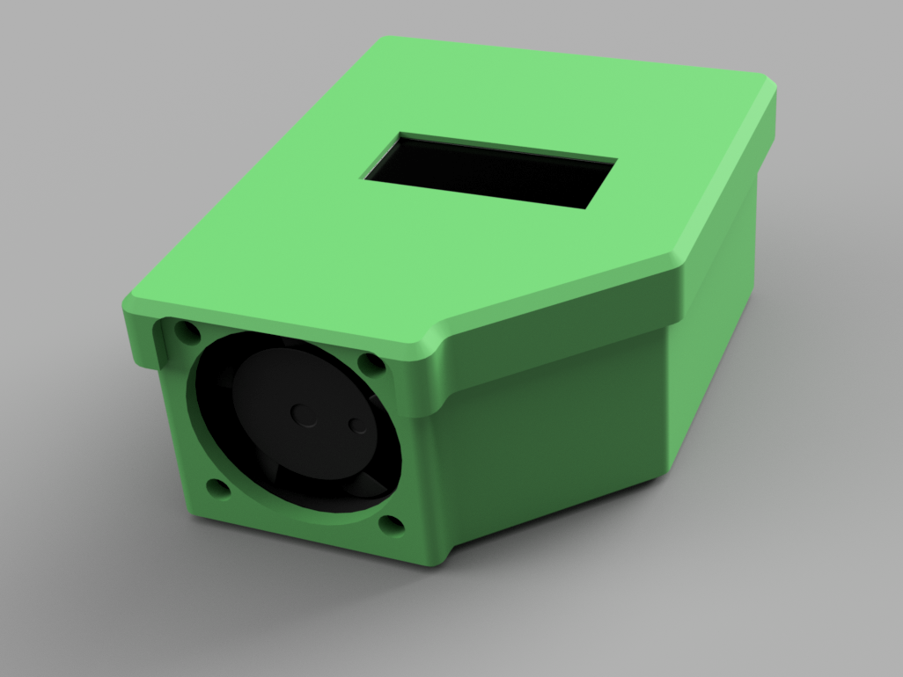
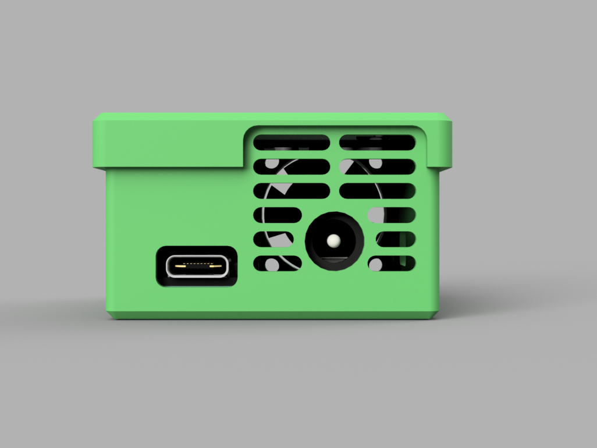
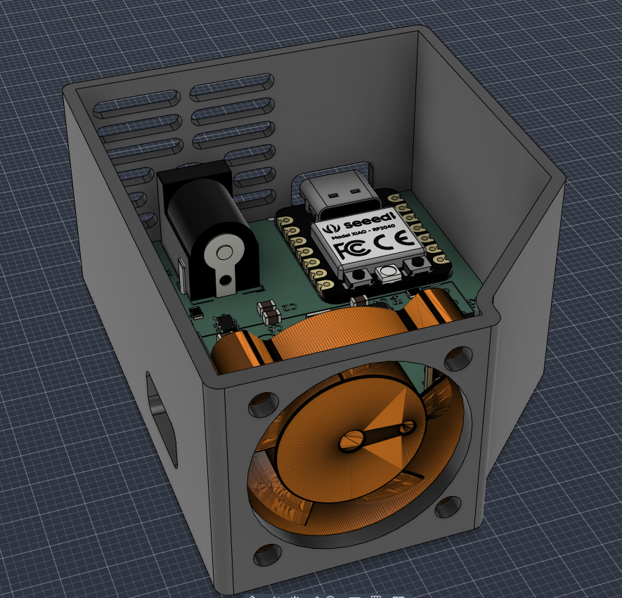
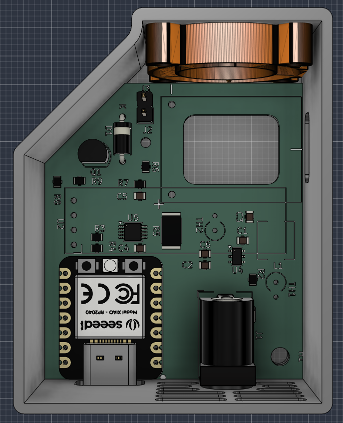
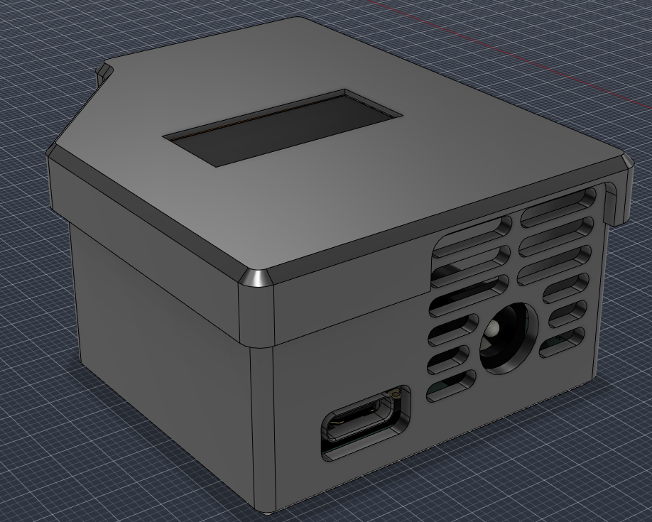

# PD65W Smart Charger 

[](https://forge.hackclub.com/projects/1660)
[](https://www.kicad.org)
[](https://www.seeedstudio.com/Seeed-XIAO-RP2040-p-5014.html)
[](https://en.wikipedia.org/wiki/USB_hardware#USB_Power_Delivery)
[](LICENSE)

---

## Project Overview

- **What is it?**  It is a fast 65W charger with Powerdelivery, but its SMART! It has XIAO RP2040 MCU inside and if you want to know more then read more below! 
- **What does it do?**  Belive or not its charging phone :O   Well, it is also charging modern notebooks and all other things, that have USB-C, with a maximum power of 65W which is really good. And WHILE it is charging your device, the RP2040 is with help of INA226 chip measuring input/output Voltage and Current and displaing it on 128x32 display. 
Also the chragers can be really hot while charging, but not this one. Why? Because this one has a FAN! And if the RP2040 starts to measure big temperature on thermistors then it will adjust FAN speed to cool it off.
- **Why does it exist?** Because normal charger from shops are boring, and with this charger you can see how much current and how big voltage is flowing to your phone! But also a good point why does this exist is to **reuse** old adapters from laptops or routers that have 9-24V.

---

## Why I Made This

A few months ago, I bought a small PD65W module on AliExpress to charge my phone and laptop from old 20V laptop adapter. I designed a simple 3D printed enclosure for it (which I also shared on [MakerWorld](https://makerworld.com/en/models/3175390-mini-pd-65w-trigger-charger-8-30v-case#profileId-3590634)). 

But when I connected a 65W power bank, and it was running at max power, the module and adapter was extremely hot! I also taped 10kΩ thermistor on the top of the power source on surface and I measured with multimeter temperatures over 55°C, and the internal heat was melting the PLA enclosure. And yes, I could just print it in PETG or ASA but that would not solve problem for this extreme heat.

That inspired me to build a complete, custom PCB based smart charger that fixes issues of that old setup:

1. **Cooling:** Added a 25x25x6mm 5V fan with holes for intake and exhaust
2. **2 Thermistors:** One thermistor is directly on the PD65W module, and second one is monitoring enclosure temperature
3. **OLED Display:** "0.91" OLED screen displays input voltage, input current, output voltage, output current, total wattage, temperatures, and fan speed **All in real time**.
5. **And lot more**

---

## Project Gallery

### 3D PCB Renders
<p align="center">
  
  
</p>

### 3D Board Views
<p align="center">
  
  
</p>

### PCB Layout & Schematic
<p align="center">
  
  
</p>

### 3D Enclosure (Fusion 360)
*Custom 3D printable enclosure designed in Fusion 360. All CAD and 3D model files (`.f3z`, `.step`) are located in the [`CAD/`](CAD/) folder.*

<p align="center">
  
  
</p>

<p align="center">
  
  
</p>

<p align="center">
  
</p>

---

### Schematic Blocks:

1. **AP63205 Step-Down Regulator:**
   - Steps down the 9V–24V DC input to a stable, clean **5.0V** (up to 2A) to power the XIAO RP2040, the 0.91" OLED display, and the 5V fan.
   - Uses a 4.7µH high-current power inductor (`L1`) and ceramic filter capacitors (`C2`, `C3`, `C4`).
2. **INA226:**
   - Sits on the primary input DC track through a precision 10mΩ (2512 size) shunt resistor (`R5`).
   - Communicates with the RP2040 over I2C (Address `0x40`), providing millivolt and milliamp precision for input power measurements.
3. **Output Voltage and Power calculation:**
   - A 100kΩ / 10kΩ precision resistor divider (`R6`, `R7`) scales down the 0V–20V USB-PD output rail to a safe 0V–1.82V signal for the RP2040 ADC (`A2`).
   - The firmware combines measured input power with known module conversion efficiency (~92%) and measured output voltage to calculate real time output current and power.
4. **2 Thermistors and Intelligent Fan:**
   - The cooling fan is controlled through a 2N2222 transistor (`Q1`) with a 1N4148 flyback diode (`D1`). If temperatures stay under 35°C, the fan stays completely silent (0% PWM). Between 35°C and 60°C, the fan dynamically scales speed (70–255 PWM). If temperature exceeds 60°C, the fan spins up at full 100% speed.

---

## Assembly Guide

### Required Tools & Materials
- Soldering iron 
- Some good solder wire
- Solder flux 
- Tweezers
- 3D Printer (for printing the Fusion 360 case in PETG, ABS, or PLA)
- Thermal paste or thermal conductive tape (for NTC thermistor contact)

### Assembly Steps

1. **Solder SMD ICs (U4, U5):**
   - Apply flux to the footprint pads of the **AP63205** (U4, TSOT-23-6) and **INA226** (U5, TSSOP-10).
   - Tack one corner pin, align all pins accurately under magnification, and solder the remaining pins.
2. **Solder SMD Passives & Inductor:**
   - Solder the 10mΩ 2512 shunt resistor (`R5`).
   - Solder 0805 SMD resistors (`R1–R4`, `R6–R9`) and capacitors (`C1–C6`).
   - Solder the 4.7µH power inductor (`L1`).
3. **Solder Through-Hole Components:**
   - Solder the 2N2222 transistor (`Q1`), 1N4148 diode (`D1`), and 2-pin Fan pin header (`J3`).
   - Solder the DC Barrel Jack (`J1`). There must be a good contact so put a lot of solder here.
4. **Modules:**
   - Solder the **XIAO RP2040** (`U3`) using female headers or solder direct-to-board as a SMD.
   - Solder the **PD65W Module** (`U1`) and connect the power output feedback wire (`J2`) between the module's positive output terminal and the voltage divider pad.
   - Mount the **0.91" I2C OLED Display** (`U2`) to the I2C header pins.
5. **Thermistors (TH1, TH2):**
   - Solder the thermistor.
   - Fasten `TH1` against the PD65W module power inductor/MOSFETs using thermal tape.
   - Position `TH2` near the board center to monitor ambient enclosure temperature.
6. **Final Case & Fan Assembly:**
   - Mount the 25mm 5V fan into the 3D-printed enclosure exhaust port and plug its 2-pin connector into `J3`.
   - Place the PCB and OLED into the case mounting hole and fasten with some tape.

---

## Firmware & Software Setup

### 1. Required Libraries
Install the following libraries via the Arduino IDE Library Manager:
- `INA226_WE` (by Wolfgang Ewald)
- `Adafruit GFX Library` (by Adafruit)
- `Adafruit SSD1306` (by Adafruit)
- `Wire` (Standard I2C library) - should be included

### 2. Flashing the XIAO RP2040
1. Connect the Seeed XIAO RP2040 to your computer via USB-C while holding down the **`BOOT`** button (or select the board port in Arduino IDE).
2. Select Board: **Seeed Studio XIAO RP2040** 
3. Open [`Firmware/code.ino`](Firmware/code.ino).
4. Click **Upload**.
5. Once uploaded, the OLED will start and will show all tha data.

### 3. OLED Telemetry Display Breakdown

```text
+-----------------------+
| IN :  24.00V  3.20A   |  <-- DC Barrel Jack Input
| OUT:  20.00V  2.95A   |  <-- USB-PD Output to Device
| PWR:  62.4W           |  <-- Total Active Power
| T1:42C T2:36C FAN:45% |  <-- Module Temp, Board Temp, Fan speed
+-----------------------+
```

---

## 📦 Bill of Materials (BOM)

> Sourced from [TME.eu](https://tme.eu), [AliExpress](https://aliexpress.com)

| Reference | Qty | Value / Component | Footprint / Package | Source / Link | Cost (USD) |
| :--- | :---: | :--- | :--- | :--- | :---: |
| **C1, C4, C5** | 3 | 100nF 50V MLCC | 0805 SMD | [TME Link](https://www.tme.eu/cz/details/cc0805krx7r9bb104/kondenzatory-mlcc-smd/yageo/) | $0.65 |
| **C2, C6** | 2 | 10µF 50V MLCC | 0805 SMD | [TME Link](https://www.tme.eu/cz/details/c2012x5r1v106kac/kondenzatory-mlcc-smd/tdk/c2012x5r1v106k125ac/) | $1.10 |
| **C3** | 1 | 22µF 16V MLCC | 0805 SMD | [TME Link](https://www.tme.eu/cz/details/cl21a226kpclrnc/kondenzatory-mlcc-smd/samsung/) | $0.39 |
| **D1** | 1 | 1N4148 Fast Switching Diode | DO-35 / DO-41 THT | [TME Link](https://www.tme.eu/cz/details/1n4148-cdi/univerzalni-diody-tht/cdil/1n4148/) | $0.1 |
| **J1** | 1 | DC Barrel Jack | Horizontal THT Barrel Jack | [TME Link](https://www.tme.eu/cz/details/fcr681465p/konektory-dc/cliff/fc681465p-dc-10lp/) | $2.42 |
| **J3** | 1 | 2-Pin Fan Header (2.54mm) + Sunon 5V Fan | PinHeader 1x02 + 25x25x6mm Fan | [TME Link](https://www.tme.eu/cz/details/mf25060v1-a99-a/ventilatory-dc-5v/sunon/mf25060v1-1000u-a99/) | $7.90 |
| **L1** | 1 | 4.7µH Power Inductor | SMD 6.3x6.3mm (LSXND6060) | [TME Link](https://www.tme.eu/cz/details/lsxnd6060yel4r7nmg/tlumivky/taiyo-yuden/) | $0.50 |
| **Q1** | 1 | 2N2222 NPN Transistor | TO-92 THT | [TME LInk](https://www.tme.eu/cz/details/2n2222a-dio/tranzistory-npn-tht/diotec-semiconductor/2n2222a/) | $0.90 |
| **R1, R2, R3, R4, R7, R9** | 6 | 10kΩ | 0805 SMD | [TME Link](https://www.tme.eu/cz/details/crcw080510k0fkea/rezistory-smd/vishay/) | $0.084 |
| **R5** | 1 | 10mΩ (0.010Ω) 1% Current Shunt | 2512 High-Power SMD | [TME Link](https://www.tme.eu/cz/details/mar251202fr010s/rezistory-smd/wayon/) | $1.98 |
| **R6** | 1 | 100kΩ 1% Resistor | 0805 SMD | [TME Link](https://www.tme.eu/cz/details/rc0805fr-07100k/rezistory-smd/yageo/rc0805fr-07100kl/) | $0.070 |
| **R8** | 1 | 1kΩ 1% Resistor | 0805 SMD | [TME Link](https://www.tme.eu/cz/details/rc0805fr-071k/rezistory-smd/yageo/rc0805fr-071kl/)  | $0.042 |
| **TH1, TH2** | 2 | 10kΩ NTC Thermistors (B=3950) | Radial / Axial THT | [TME Link](https://www.tme.eu/cz/details/b57891m0103j000/merici-termistory-ntc-tht/tdk/) | $1.45 |
| **U1** | 1 | PD65W USB-C PD Step-Down Module | Custom Module Footprint | [AliExpress Link](https://www.aliexpress.com/item/1005012593373561.html) | $6.00 |
| **U2** | 1 | 0.91" I2C Monochrome OLED Display | 4-Pin I2C Module Header | [AliExpress Link](https://www.aliexpress.com/item/1005008918700196.html) | $5.50 |
| **U3** | 1 | Seeed Studio XIAO RP2040 MCU | XIAO DIP-14 Module | [TME Link](https://www.tme.eu/cz/details/seeed-102010428/vyvojove-kity-ostatni/seeed-studio/xiao-rp2040/) | $7.00 |
| **U4** | 1 | AP63205WU 5V 2A Buck Regulator | TSOT-23-6 SMD | [AliExpress Link](https://www.aliexpress.com/item/1005006407229203.html) | $4.00 |
| **U5** | 1 | INA226AIDGSR Power Monitor IC | TSSOP-10 SMD | [TME Link](https://www.tme.eu/cz/details/ina226aidgsr/operacni-zesilovace-smd/texas-instruments/) | $6.00 |
| **PCB** | 1 | 2-Layer Custom FR-4 PCB (1.6mm) | Custom KiCad Design | [JLCPCB](https://jlcpcb.com) | $9.53 |
| **Shipping** | - | Combined Estimated Shipping | - | AliExpress & TME.eu | ~$10.00 |
| **Total** | | | | | **~$65.62** |

>btw you can import every components that is from TME directly to TME cart with this file: [quick_order_TME.csv](quick_order_TME.csv) 

<p>

</p>

---

## 🚀 How to Use

1. **Connect DC Power:** Plug any 9V to 24V DC power source (almost every old laptop charger) into the rear barrel jack `J1`.
2. **System Initialization:** The OLED display will lights up, showing the measured input voltages and temperatures.
3. **Charge your Device!:** Just connect anything you have with USB-C! (even laptops)
4. **Automatic Cooling:** Under heavy sustained loads (e.g., 45W–65W), the internal fan will automatically spin up smoothly based on thermistor readings, keeping components well within safe operating temperatures.

---


- Designed by **Šámot** in [Hack Club Forge](https://forge.hackclub.com/projects/1660) project.
