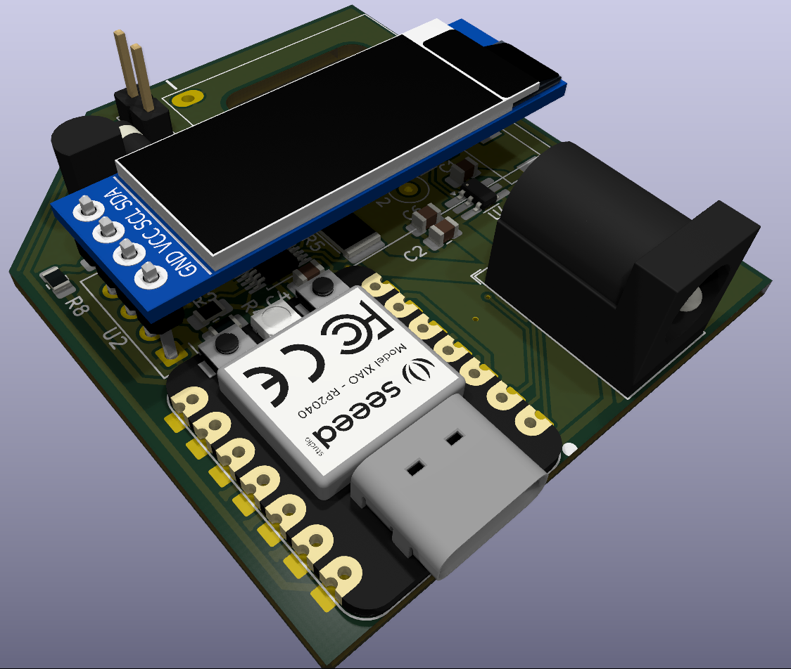
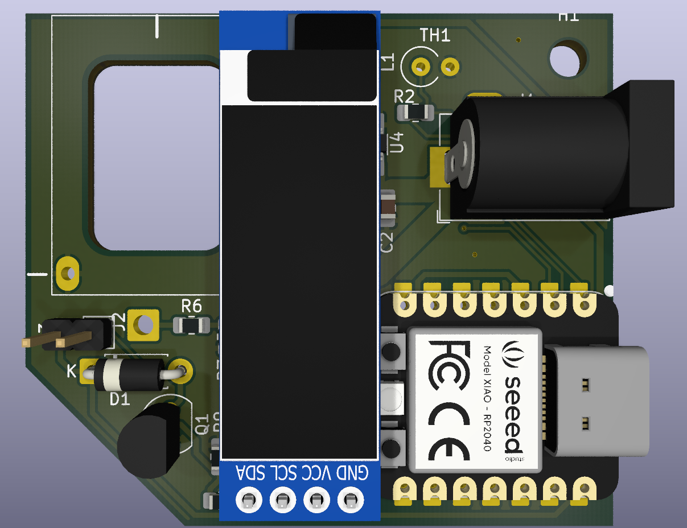
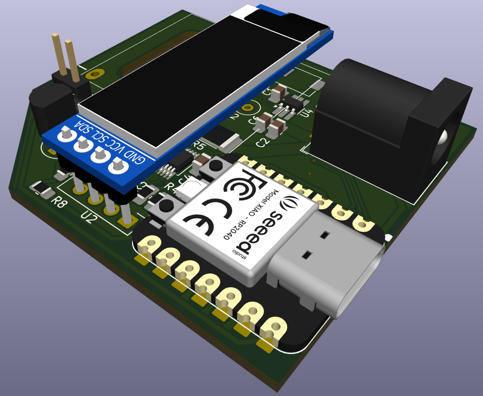
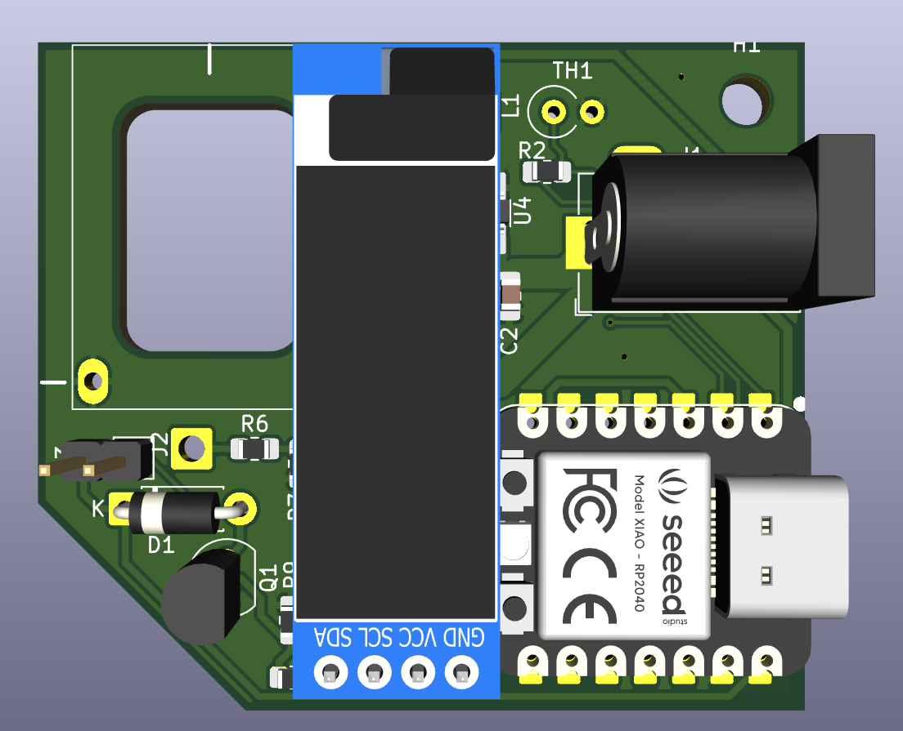
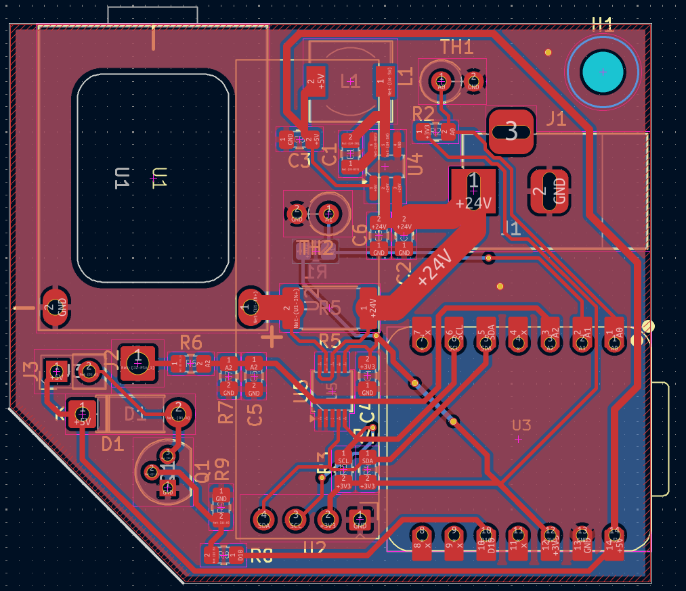
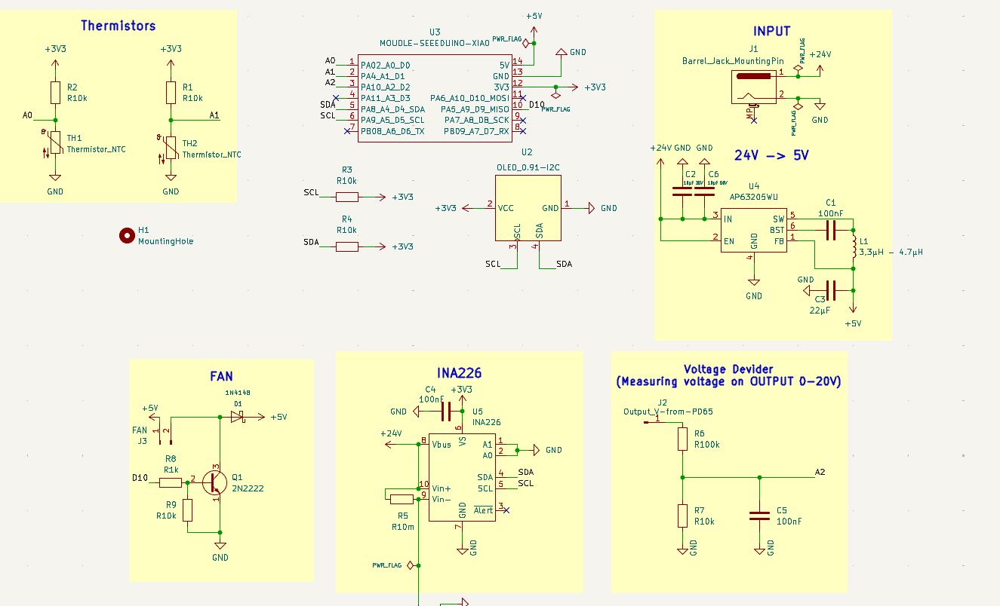
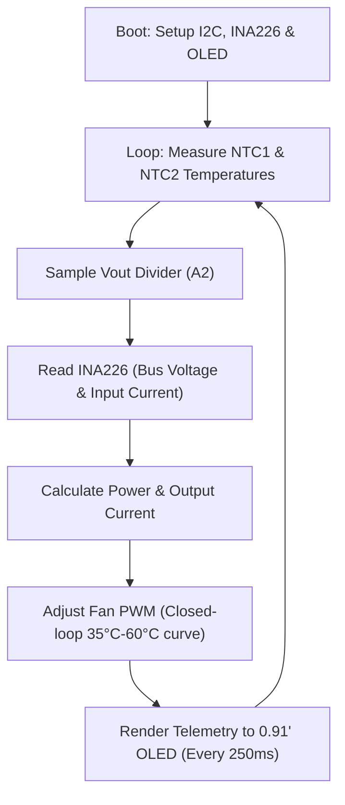
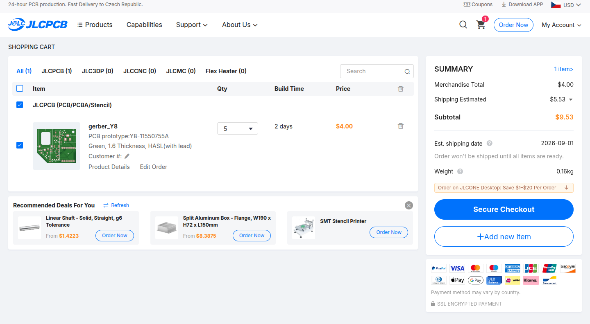

# PD65W Smart Charger & Power Monitor

[](https://forge.hackclub.com/projects/1660)
[](https://www.kicad.org)
[](https://www.seeedstudio.com/Seeed-XIAO-RP2040-p-5014.html)
[](https://en.wikipedia.org/wiki/USB_hardware#USB_Power_Delivery)
[](LICENSE)

---

## Project Overview & Purpose

- **What is it?** A smart, compact 65W USB Type-C with Power Delivery desktop charging station and real-time power telemetry monitor powered by a Seeed Studio XIAO RP2040 microcontroller, with active cooling, an I2C OLED display, and a custom Fusion 360 3D-printed enclosure.
- **What does it do?** It takes a wide DC barrel jack input (9V–24V DC from some laptop power bricks, or power bricks) and converts it into fast-charging USB-PD profiles (5V, 9V, 12V, 15V, and 20V up to 65W / 3.25A) for laptops, phones, tablets, power banks and lot moroe what has USB-C. While charging, an onboard **INA226** 16-bit power monitor and dual **NTC thermistors** measure input/output voltages, current, power draw, and component temperatures. The RP2040 dynamically adjusts a 5V cooling fan via PWM and renders live stats on a 0.91" OLED display.
- **Why does it exist?** Standard USB-C chargers are sealed boxes with no insight into real power draw or conversion efficiency. Also, compact 65W modules generate high heat under sustained loads that quickly cause thermal throttling and case melting. This project provides an open-source, actively cooled, and fully transparent desktop power station that gives old DC power bricks a second life.

---

## Why I Made This Project

A couple of months ago, I bought a compact 65W USB-PD step-down module on AliExpress to charge my phone and laptop from an old 20V laptop adapter. I designed a simple 3D-printed enclosure for it (which I shared on [MakerWorld](https://makerworld.com/en/models/3175390-mini-pd-65w-trigger-charger-8-30v-case#profileId-3590634)). 

However, when I connected a 65W power bank, the module overheated severely! Using a taped 10kΩ thermistor and multimeter, I measured surface temperatures over **55°C**, and the internal heat began melting and warping the PLA enclosure. And yes, I could just print it in PETG or ASA but that would not solve problem for this extreme heat.

That inspired me to build a complete, custom PCBbased smart charger from scratch that fixes every flaw of the original setup:

1. **Active Dynamic Cooling:** By adding a 25x25x6mm 5V fan with dedicated intake and exhaust air channels, the charger stays cool under continuous 65W loads without overheating.
2. **Dual NTC Temperature Monitoring:** One thermistor sits directly on the PD65W power module, and another monitors ambient enclosure temperature, giving the RP2040 closed-loop thermal feedback.
3. **Integrated Live OLED Telemetry:** Instead of using external USB inline meters, an integrated **INA226** sensor and 0.91" OLED screen display live input voltage, input current, output voltage, output current, total wattage, temperatures, and fan speed.
4. **Repurposing Surplus DC Power Bricks:** Upcycling old 19V–24V laptop chargers and DC adapters into modern, high-speed USB-C PD power supplies.
5. **Hands-on Mixed-Signal PCB Design:** Designing a complete power board in KiCad, building a 24V-to-5V synchronous buck converter (AP63205), routing wide 2mm high-current copper tracks, and modeling a precision snap-fit enclosure in Autodesk Fusion 360.

---

## Project Gallery

### 3D PCB Renders
<p align="center">
  
  
</p>

### 3D Board Views
<p align="center">
  
  
</p>

### PCB Layout & Schematic
<p align="center">
  
  
</p>

### 3D Enclosure (Fusion 360)
*Custom 3D printable enclosure designed in Autodesk Fusion 360 with optimized airflow ducts, snap-fit lid, OLED hole, and mounting cutouts.*

<p align="center">
  
  
</p>

<p align="center">
  
  
</p>

---

## Hardware Features & Technical Specifications

| Feature | Specification |
| --- | --- |
| **Microcontroller** | Seeed Studio XIAO RP2040 (Dual-core ARM Cortex-M0+ @ 133MHz, 264KB SRAM, 2MB Flash) |
| **Power Input** | DC Barrel Jack (5.5x2.1mm / 5.5x2.5mm standard), **9V – 24V DC** |
| **Fast Charging Controller** | 65W High-Efficiency Synchronous USB-C PD Module (Supports PD3.0, QC4+, PPS, AFC, FCP) |
| **USB-PD Output Profiles** | 5V @ 3A, 9V @ 3A, 12V @ 3A, 15V @ 3A, 20V @ 3.25A (**Up to 65W Max**) |
| **Auxiliary Step-Down Buck** | Diodes Inc. **AP63205WU** (5V / 2A Synchronous Buck Converter, TSOT-23-6) |
| **Power & Current Monitor** | Texas Instruments **INA226** (16-bit I2C Bi-directional Bus & Shunt Current Sensor) |
| **Current Sense Shunt** | 10 mΩ (0.010 Ω), 2512 High-Power SMD Resistor (`R5`, Max 5A continuous) |
| **Thermal Sensing** | 2x 10kΩ NTC Thermistors (`TH1`: PD module, `TH2`: Ambient board/regulator) |
| **Active Cooling** | Sunon 5V DC Brushless Fan (25x25x6mm) driven by 2N2222 NPN Transistor via MCU PWM |
| **Display** | 0.91" I2C OLED Monochrome Display (128x32 SSD1306, Address `0x3C`) |
| **Enclosure** | Custom Fusion 360 3D-printed enclosure with dedicated fan air-intake and exhaust holes |

---

### Key Circuit Subsystems:

1. **AP63205 Step-Down Auxiliary Regulator:**
   - Steps down the 9V–24V DC input to a stable, clean **5.0V rail** (up to 2A) to power the XIAO RP2040, the 0.91" OLED display, and the 5V cooling fan.
   - Utilizes a 4.7µH high-current power inductor (`L1`) and low-ESR ceramic filter capacitors (`C2`, `C3`, `C4`).
2. **INA226 High-Side Bus & Current Monitoring:**
   - Sits on the primary input DC rail across a precision 10mΩ (2512 package) shunt resistor (`R5`).
   - Communicates with the RP2040 over I2C (Address `0x40`), providing millivolt and milliamp precision for input power measurements.
3. **Output Voltage & Power Estimation:**
   - A 100kΩ / 10kΩ precision resistor divider (`R6`, `R7`) scales down the 0V–20V USB-PD output rail to a safe 0V–1.82V signal for the RP2040 ADC (`A2`).
   - The firmware combines measured input power with known module conversion efficiency (~92%) and measured output voltage to calculate real-time output current and power delivery.
4. **Dual NTC Temperature Probes & Intelligent Fan Control:**
   - Two 10kΩ NTC thermistors (`TH1` on the PD module, `TH2` for ambient board temperature) are sampled with the Steinhart-Hart equation.
   - The cooling fan is driven through a 2N2222 NPN transistor (`Q1`) with a 1N4148 flyback diode (`D1`). If temperatures stay under 35°C, the fan stays completely silent (0% PWM). Between 35°C and 60°C, the fan dynamically scales speed (70–255 PWM). If temperature exceeds 60°C, the fan runs at full 100% blast.

---

## 🛠️ Step-by-Step Assembly Guide

> [!IMPORTANT]
> Some components (such as the AP63205 TSOT-23-6 and INA226 TSSOP-10) have fine pitch leads (0.5mm - 0.95mm). Use a fine soldering iron tip or hot air rework station with plenty of quality rosin/no-clean flux and solder wick.

### Required Tools & Materials
- Soldering iron (or hot air station)
- Some good solder wire
- Solder flux 
- Tweezers
- 3D Printer (for printing the Fusion 360 case in PETG, ABS, or PLA)
- Thermal paste or thermal conductive tape (for NTC thermistor contact)

### Assembly Steps

1. **Solder SMD ICs (U4, U5):**
   - Apply flux to the footprint pads of the **AP63205** (U4, TSOT-23-6) and **INA226** (U5, TSSOP-10).
   - Tack one corner pin, align all pins accurately under magnification, and solder the remaining pins.
2. **Solder SMD Passives & Inductor:**
   - Solder the 10mΩ 2512 shunt resistor (`R5`).
   - Solder 0805 SMD resistors (`R1–R4`, `R6–R9`) and ceramic capacitors (`C1–C6`).
   - Solder the 4.7µH power inductor (`L1`).
3. **Solder Through-Hole Components:**
   - Solder the 2N2222 NPN transistor (`Q1`), 1N4148 flyback diode (`D1`), and 2-pin Fan pin header (`J3`).
   - Solder the DC Barrel Jack (`J1`). Ensure the solder joints fully penetrate the mechanical support pads.
4. **Mount Core Modules:**
   - Solder the **Seeed Studio XIAO RP2040** (`U3`) using female headers or solder direct-to-board as a surface module.
   - Solder the **PD65W Module** (`U1`) and connect the power output feedback wire (`J2`) between the module's positive output terminal and the voltage divider pad.
   - Mount the **0.91" I2C OLED Display** (`U2`) to the I2C header pins.
5. **Install NTC Thermistors (TH1, TH2):**
   - Solder the thermistor leads.
   - Fasten `TH1` against the PD65W module power inductor/MOSFETs using thermal tape.
   - Position `TH2` near the board center / buck converter to monitor ambient enclosure temperature.
6. **Pre-Power Quality & Continuity Checks:**
   - Using a multimeter in continuity mode:
     - Check between **DC IN+** and **GND** &rarr; Verify NO short circuit.
     - Check between **5V Rail** and **GND** &rarr; Verify NO short circuit.
     - Check between **3.3V Rail** and **GND** &rarr; Verify NO short circuit.
   - Connect a 12V–20V DC power supply to the barrel jack and verify steady 5.0V output on the AP63205 buck stage before seating the XIAO/OLED.
7. **Final Case & Fan Assembly:**
   - Mount the 25mm 5V fan into the 3D-printed enclosure exhaust port and plug its 2-pin connector into `J3`.
   - Place the PCB and OLED into the case mounting hole and fasten with some tape.

---

## Firmware & Software Setup

The RP2040 runs an Arduino-based real-time telemetry and control loop:



### 1. Required Libraries
Install the following libraries via the Arduino IDE Library Manager or PlatformIO:
- `INA226_WE` (by Wolfgang Ewald)
- `Adafruit GFX Library` (by Adafruit)
- `Adafruit SSD1306` (by Adafruit)
- `Wire` (Standard I2C library)

### 2. Flashing the XIAO RP2040
1. Connect the Seeed XIAO RP2040 to your computer via USB-C while holding down the **`BOOT`** button (or select the board port in Arduino IDE / PlatformIO).
2. Select Board: **Seeed Studio XIAO RP2040** 
3. Open [`Firmware/code.ino`](Firmware/code.ino).
4. Click **Upload**.
5. Once uploaded, the OLED will initialize and show live sensor readings.

### 3. OLED Telemetry Display Breakdown

```text
+-----------------------+
| IN :  24.00V  3.20A   |  <-- DC Barrel Jack Input
| OUT:  20.00V  2.95A   |  <-- USB-PD Output to Device
| PWR:  62.4W           |  <-- Total Active Power
| T1:42C T2:36C FAN:45% |  <-- Module Temp, Board Temp, Fan speed
+-----------------------+
```

---

## 📦 Bill of Materials (BOM)

> Sourced from [TME.eu](https://tme.eu), [AliExpress](https://aliexpress.com)

| Reference | Qty | Value / Component | Footprint / Package | Source / Link | Cost (USD) |
| :--- | :---: | :--- | :--- | :--- | :---: |
| **C1, C4, C5** | 3 | 100nF 50V MLCC | 0805 SMD | [TME Link](https://www.tme.eu/cz/details/cc0805krx7r9bb104/kondenzatory-mlcc-smd/yageo/) | $0.65 |
| **C2, C6** | 2 | 10µF 50V MLCC | 0805 SMD | [TME Link](https://www.tme.eu/cz/details/c2012x5r1v106kac/kondenzatory-mlcc-smd/tdk/c2012x5r1v106k125ac/) | $1.10 |
| **C3** | 1 | 22µF 16V MLCC | 0805 SMD | [TME Link](https://www.tme.eu/cz/details/cl21a226kpclrnc/kondenzatory-mlcc-smd/samsung/) | $0.39 |
| **D1** | 1 | 1N4148 Fast Switching Diode | DO-35 / DO-41 THT | [TME Link](https://www.tme.eu/cz/details/1n4148-cdi/univerzalni-diody-tht/cdil/1n4148/) | $0.1 |
| **J1** | 1 | DC Barrel Jack | Horizontal THT Barrel Jack | [TME Link](https://www.tme.eu/cz/details/fcr681465p/konektory-dc/cliff/fc681465p-dc-10lp/) | $2.42 |
| **J3** | 1 | 2-Pin Fan Header (2.54mm) + Sunon 5V Fan | PinHeader 1x02 + 25x25x6mm Fan | [TME Link](https://www.tme.eu/cz/details/mf25060v1-a99-a/ventilatory-dc-5v/sunon/mf25060v1-1000u-a99/) | $7.90 |
| **L1** | 1 | 4.7µH Power Inductor | SMD 6.3x6.3mm (LSXND6060) | [TME Link](https://www.tme.eu/cz/details/lsxnd6060yel4r7nmg/tlumivky/taiyo-yuden/) | $0.50 |
| **Q1** | 1 | 2N2222 NPN Transistor | TO-92 THT | [TME LInk](https://www.tme.eu/cz/details/2n2222a-dio/tranzistory-npn-tht/diotec-semiconductor/2n2222a/) | $0.90 |
| **R1, R2, R3, R4, R7, R9** | 6 | 10kΩ | 0805 SMD | [TME Link](https://www.tme.eu/cz/details/crcw080510k0fkea/rezistory-smd/vishay/) | $0.084 |
| **R5** | 1 | 10mΩ (0.010Ω) 1% Current Shunt | 2512 High-Power SMD | [TME Link](https://www.tme.eu/cz/details/mar251202fr010s/rezistory-smd/wayon/) | $1.98 |
| **R6** | 1 | 100kΩ 1% Resistor | 0805 SMD | [TME Link](https://www.tme.eu/cz/details/rc0805fr-07100k/rezistory-smd/yageo/rc0805fr-07100kl/) | $0.070 |
| **R8** | 1 | 1kΩ 1% Resistor | 0805 SMD | [TME Link](https://www.tme.eu/cz/details/rc0805fr-071k/rezistory-smd/yageo/rc0805fr-071kl/)  | $0.042 |
| **TH1, TH2** | 2 | 10kΩ NTC Thermistors (B=3950) | Radial / Axial THT | [TME Link](https://www.tme.eu/cz/details/b57891m0103j000/merici-termistory-ntc-tht/tdk/) | $1.45 |
| **U1** | 1 | PD65W USB-C PD Step-Down Module | Custom Module Footprint | [AliExpress Link](https://www.aliexpress.com/item/1005012593373561.html) | $6.00 |
| **U2** | 1 | 0.91" I2C Monochrome OLED Display | 4-Pin I2C Module Header | [AliExpress Link](https://www.aliexpress.com/item/1005008918700196.html) | $5.50 |
| **U3** | 1 | Seeed Studio XIAO RP2040 MCU | XIAO DIP-14 Module | [TME Link](https://www.tme.eu/cz/details/seeed-102010428/vyvojove-kity-ostatni/seeed-studio/xiao-rp2040/) | $7.00 |
| **U4** | 1 | AP63205WU 5V 2A Buck Regulator | TSOT-23-6 SMD | [AliExpress Link](https://www.aliexpress.com/item/1005006407229203.html) | $4.00 |
| **U5** | 1 | INA226AIDGSR Power Monitor IC | TSSOP-10 SMD | [TME Link](https://www.tme.eu/cz/details/ina226aidgsr/operacni-zesilovace-smd/texas-instruments/) | $6.00 |
| **PCB** | 1 | 2-Layer Custom FR-4 PCB (1.6mm) | Custom KiCad Design | [JLCPCB](https://jlcpcb.com) | $9.53 |
| **Shipping** | - | Combined Estimated Shipping | - | AliExpress & TME.eu | ~$10.00 |
| **Total** | | | | | **~$65.62** |

>btw you can import every components that is from TME directly to TME cart with this file: [quick_order_TME.csv](quick_order_TME.csv) 

<p>

</p>

---

## 🚀 How to Use

1. **Connect DC Power:** Plug any 9V to 24V DC power source (such as a 19V laptop charger) into the rear barrel jack `J1`.
2. **System Initialization:** The 0.91" OLED display immediately boots up, showing the measured input voltage (e.g. `19.50V`) and initial sensor temperatures.
3. **Plug in Device:** Connect your laptop, phone, power bank, or USB-C device to the front USB-C port.
4. **Observe Real-Time Telemetry:**
   - Watch the negotiated USB-PD profile (5V, 9V, 15V, or 20V) and live charging current on the OLED.
   - Observe total power draw in Watts.
5. **Automatic Cooling:** Under heavy sustained loads (e.g., 45W–65W), the internal fan will automatically spin up smoothly based on thermistor readings, keeping components well within safe operating temperatures.

---


- Designed by **Šámot** in [Hack Club Forge](https://forge.hackclub.com/projects/1660) project.
